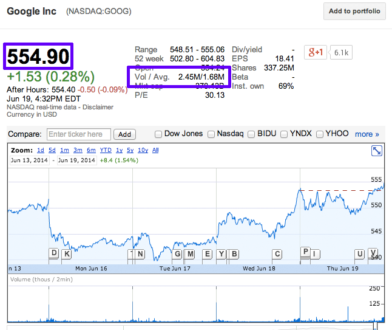

# Chrome Extension:  Simple Financial Data Extractor

## Summary

This project is a simple Google Chrome extension to gather activity data on a user as they visit web sites.  (Note:  initially, this project was spec'ed to freelancer.com, so done in the finance domain to protect IP from actual project.)  

### Installation

   1. On plug-in install, ask the user for their email.
   2. Store this email in local cache.
   3. Read the approved site list at http://finance.betaspaces.com/api/v1/user/approved-sites.
   4. Store this list in local cache.

### Usage

   1. Do the following for ONLY web sites that are listed in the approved list above (1c) – see below for sample event messages.
      1. Capture Event Message
         1. PageView - http://en.wikipedia.org/wiki/ISO_8601
         2. LinkClick
         3. (Google Finance only) ViewQuote
      1. Send message as POST to http://finance.betaspaces.com/api/v1/statements/

### Sample Event Messages

POST to http://finance.betaspaces.com/api/v1/statements/.  If you POST successfully, you’ll receive a 200 OK and a JSON filename as a response (i.e. “14032276987067.json”).  Otherwise, you’ll receive a 404.

1.) Page View

	{
    	"user":{
        	"email":"mailto:user1@email.null"
        	},
        "action":{
            	"id":"verbs/viewed",
            	"display":{
                	"en-US":"viewed"
            	},
            	"value":{
                	"time":"3M14S"
            	}
	       },
    	"url":{
        	"id":"https://www.google.com/finance?q=GOOG"
        	}
	}

2.) Link Click

	{
    	"user":{
        	"email":"mailto:user1@email.null"
        	},
        	"action":{
            	"id":"verbs/clicked",
            	"display":{
                	"en-US":"clicked"
            	},
            	"value":{
                	"url":"https://www.google.com/finance?q=APPL"
            	}
        	},
        	"url":{
            	"id":"https://www.google.com/finance?q=GOOG"
        	}
    	}
	}

3.) If Google Finance (https://www.google.com/finance?q=[quote symbol]), then, View Quote:

	{
    	"user":{
        	"email":"mailto:user1@email.null"
        	},
        	"action":{
            	"id":"verbs/quoted",
            	"display":{
                	"en-US":"quoted"
            	},
            	"value":{
                	"quote":"GOOG",
                	"price":"554.90",
                	"volavg":"2.45M/1.68M"
            	}
        	},
        	"url":{
            	"id":"https://www.google.com/finance?q=GOOG"
        	}
    	}
	}

View Quote: (quote, Volume, price, Browser Time)

Price = div#price-panel
Volume = table.snap-data and td.class=val
