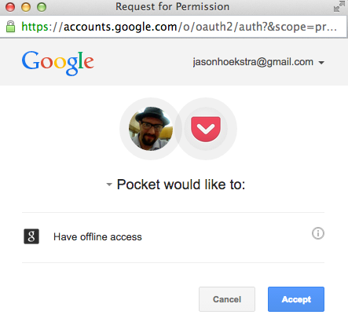
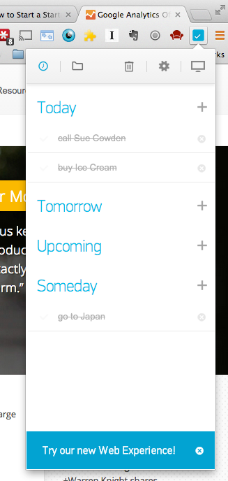

# Chrome Extension v0.3 Research

Below is a research on the Chrome Web Store for user experience and rights access for various popular Chrome Extensions.

## User Experience

### Pin It Button (Pinterest)

**Purpose:**  To clip images from web pages on to Pinterest account

**Install:**  Standard install, with extra popup

**Login:**  None on install  (minimal user interaction until needed).  Only after action.

**Action:**  On click, extracts images from page.  Clicking on image then requests login.

### Save to Pocket (Pocket)

**Purpose:** To clip web pages of interest to Pocket account for later viewing

**Install**:  Opens well-designed next-steps instructional page, with clear Sign-Up and Log In buttons

 

They are A/B testing - see alternate experience encouraging mobile apps:

 

**Login:**:  Well guided sign-up user experience, made fast/easy w/ G+.  I thought I had a Pocket account, didn't, very easy to create new account.  Easier with G+.

Web page pop-up path (guides to https://getpocket.com/installed):

Whoops, misstep in ideal UX flow - they didn't detect extension was already installed, but interesting here:  their privacy notice and link to policy.

Also, directly clicking on button without logging in:

**Action**:  Clicking on button clips article to Pocket.  Shows nice dialog with options to tag or view on Pocket.

Additionally:  When a page has been clipped, the extension icon goes from color Grey to Mauve.

### Any.do Extension

**Purpose:**  Task manager

**Install:**  Standard install (no pop-up)

**Login:**  None launched on install.  Clicking on button first launches login.  User can login and register via extension, redirect to web page not needed.  Facebook and G+ supported as well.

**Action:**  On click, simple view of today, tomorrow, future tasks.  Simple add of new tasks.

Action from extension:

They also insert actions into Gmail, interesting:

## Rights

- Pin It Button (Pinterest) - Read/modify all your data on the websites you visit
- Pocket - Read/modify all your data on the websites you visit
- Readability -  Read/modify all your data on the websites you visit
- Any.do - Read/modify all your data on the websites you visit
